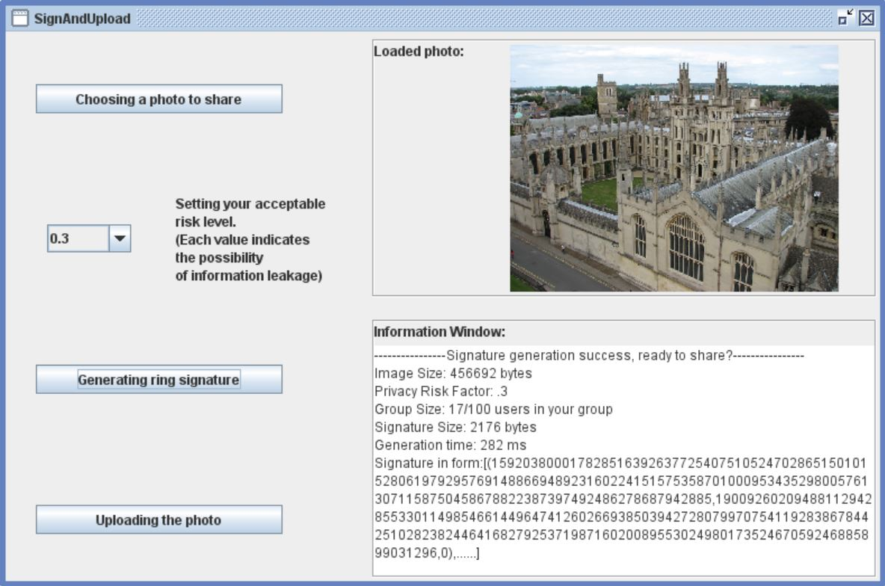

# crowdShield
A demo of leveraging the crowd wisdom for photo geo-privacy in paper entitled *"The Crowd Wisdom for Location Privacy of Crowdsensing Photos:Spear or Shield?"*.

- This implementation realizes an adaptive grouping-based ring signature function as a basic module. Given the personalized privacy requirements, 
the module adaptively divides entities into groups with same privacy domain.

- Partcipants/users can use the module to attain anonymous signing, in this way, joining in a visual crowdsensing task with guarantee on geo-privacy safety.

*NOTE*: this demo currently performs the setting, signing, and verifying steps all at the user side.
In future, it can be easily merged into a crowdsensing platform to support visual sensing and privacy protection distributedly.

## A snapshot for the prototype

